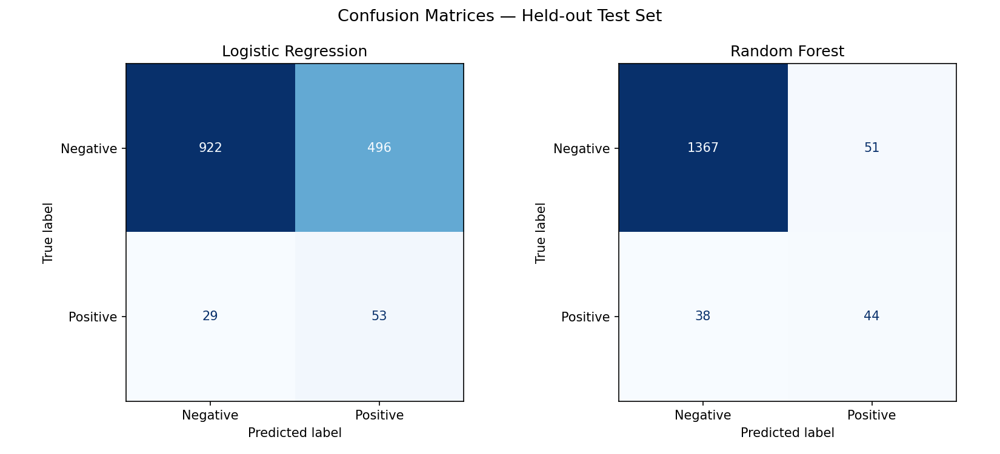
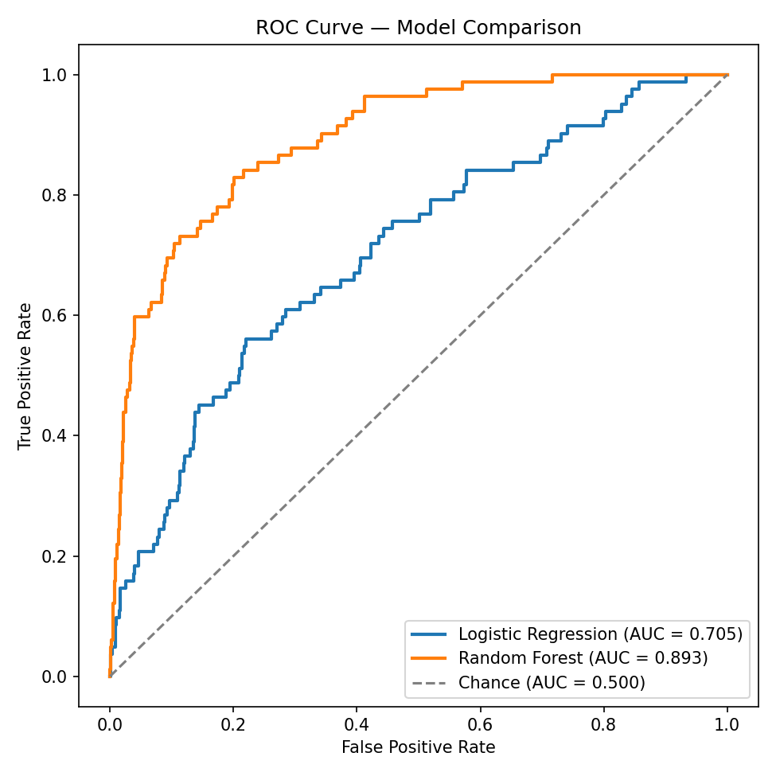
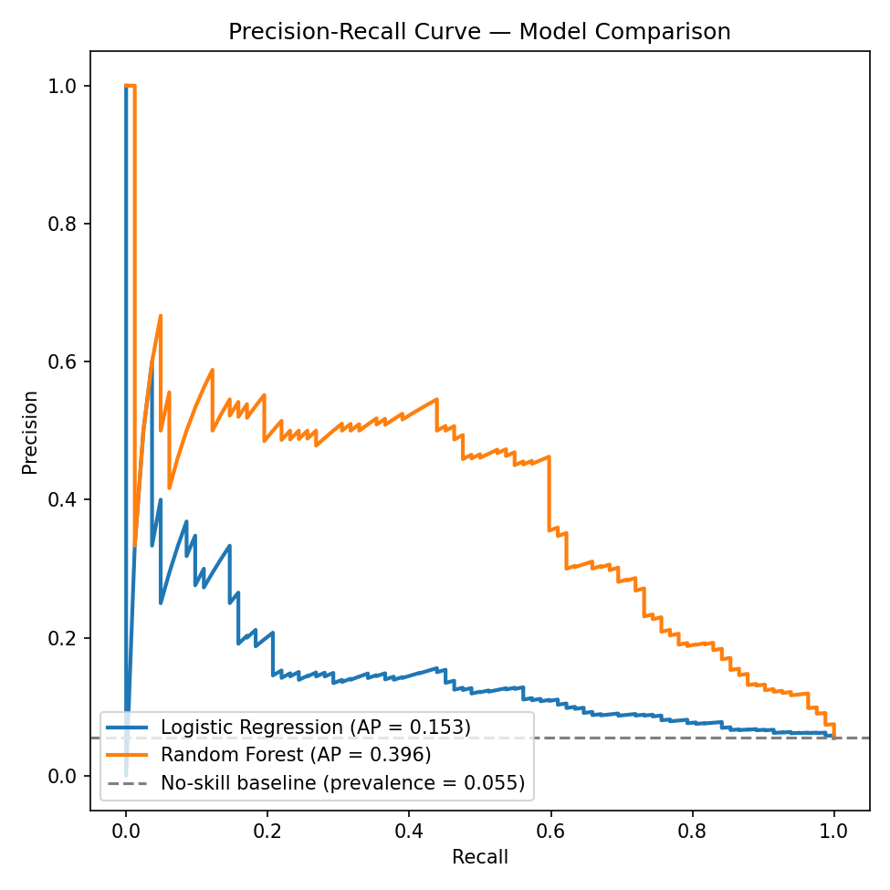

# Model Evaluation Toolkit

Cross-validation, confusion matrices, ROC-AUC, and precision-recall — applied to an imbalanced classification problem.

**Tools used:** scikit-learn (`StratifiedKFold`, `cross_val_score`, `confusion_matrix`, `ConfusionMatrixDisplay`, `roc_curve`, `roc_auc_score`, `precision_recall_curve`), Matplotlib.

## Files

| File | Contents |
|---|---|
| `eval_toolkit.py` | Reusable functions: `run_cross_validation`, `cross_validate_multi_metric`, `plot_confusion_matrix`, `plot_roc_curves`, `plot_pr_curves`, `full_report`. Import these into any project. |
| `demo.py` | End-to-end script: builds the imbalanced dataset, trains both models, runs CV, generates every plot and number below. |

### Quick usage

```python
from eval_toolkit import cross_validate_multi_metric, plot_roc_curves, plot_pr_curves

cv = cross_validate_multi_metric(my_model, X_train, y_train, k=5, metrics=("accuracy", "f1"))
# cv["accuracy"]["mean"], cv["accuracy"]["std"], ...

plot_roc_curves({"My Model": y_score}, y_test)
plot_pr_curves({"My Model": y_score}, y_test)
```

Run with `pip install scikit-learn matplotlib numpy`, then `python3 demo.py`.

---

## 1. The Dataset

A synthetic binary classification dataset (6,000 samples, 20 features) built with `make_classification`, weighted to **94.5% negative / 5.5% positive** — deliberately mimicking a fraud/anomaly-style imbalance where the thing you care about is rare. Split 75/25 into train/test with `stratify=y` so both sets keep the same class ratio.

**Class balance:** 5,671 negative vs. 329 positive (5.5% positive rate)
**Naive baseline** ("always predict negative") test accuracy: **94.5%** — and it catches zero positive cases. This is the number every other result below needs to be read against.

## 2. Two Models, Same Data

Compared **Logistic Regression** (linear, `class_weight="balanced"`) against **Random Forest** (300 trees, max depth 8, `class_weight="balanced"`). Both get identical cross-validation and identical held-out test data.

## 3. Stratified 5-Fold Cross-Validation

Cross-validation ran on the *training* split only (test set stays untouched until the end), using `StratifiedKFold(n_splits=5)` so every fold preserves the ~5.5% positive rate — plain `KFold` risks a fold with almost no positive examples at all on data this skewed. Reporting mean ± standard deviation, not a single score, so we can see how stable each model is across folds.

| Model | CV Accuracy (mean ± std) | CV F1 (mean ± std) |
|---|---|---|
| Logistic Regression | 0.656 ± 0.011 | 0.166 ± 0.010 |
| Random Forest | 0.931 ± 0.010 | 0.319 ± 0.051 |

Note the gap between the two metrics for Logistic Regression: 65.6% accuracy but only 0.166 F1. That gap *is* the imbalance problem showing up before we even touch the test set — accuracy and F1 are telling different stories about the same model.

## 4. Confusion Matrices — Held-Out Test Set



Logistic Regression trades away negative-class accuracy for recall: it misclassifies 496 of 1,418 true negatives as positive, but does catch 53 of 82 real positives. Random Forest is far more balanced: only 51 false positives, and 44 of 82 positives caught, while barely touching negative-class accuracy (96.4%).

## 5. ROC Curve and AUC



Random Forest: **AUC = 0.893**. Logistic Regression: **AUC = 0.705**. Random Forest's curve sits well above Logistic Regression's across essentially the whole false-positive-rate range — its ranking of positive vs. negative examples is meaningfully better, not just its default-threshold behavior.

## 6. Precision-Recall Curve



Random Forest: **Average Precision = 0.396**. Logistic Regression: **AP = 0.153**. The gap between the two models is much more dramatic here than on the ROC curve — which is exactly the point of the next section.

### Why precision-recall matters more than ROC-AUC here

ROC-AUC's x-axis is **false positive rate** = FP / (FP + TN). With 1,418 true negatives in the test set, a model has to rack up hundreds of false positives before FPR moves much — so ROC curves look deceptively good on heavily imbalanced data, because the negative class is so large it absorbs a lot of mistakes without the curve noticing.

Precision's denominator is **predicted positives** (TP + FP) — a much smaller number when positives are rare — so every false positive shows up immediately as a drop in precision. That's usually the number a business actually cares about: if only 5–10% of "flagged as fraud" cases are real, an analyst team drowns in false alarms regardless of what the ROC-AUC says.

Concretely here: both curves rank Random Forest above Logistic Regression, but the ROC-AUC gap (0.893 vs. 0.705, a ~27% relative difference) understates how much better Random Forest actually is at the task investigators care about — the AP gap (0.396 vs. 0.153) is a **~160% relative difference**. On imbalanced problems (fraud, disease screening, spam, defect detection), default to precision-recall as the primary curve, and treat ROC-AUC as a secondary, model-ranking sanity check.

## 7. Accuracy Alone Would Have Misled Us

| Model | Accuracy | F1 | ROC-AUC | Avg. Precision |
|---|---|---|---|---|
| "Always predict negative" (naive) | **94.5%** | 0.000 | 0.500 | 0.055 |
| Logistic Regression | 65.0% | 0.168 | 0.705 | 0.153 |
| Random Forest | 94.1% | 0.497 | 0.893 | 0.396 |

Read accuracy alone and the naive "predict nothing" baseline (94.5%) looks *better* than Logistic Regression (65.0%) — even though the baseline is strictly useless, missing every single positive case, while Logistic Regression at least catches 65% of them. Random Forest's accuracy (94.1%) is nearly identical to the naive baseline's, which on its own would suggest it isn't doing much — but its F1, ROC-AUC, and AP all show it's a genuinely strong classifier. Accuracy alone can't distinguish "does nothing" from "solves the problem" or "does something but not enough" — that's why it's always paired with a confusion matrix or PR curve on skewed data.

## 8. Which Model Would I Actually Deploy?

> **Deploy: Random Forest.**
>
> It wins on every metric that matters for this task: F1 (0.497 vs. 0.168), ROC-AUC (0.893 vs. 0.705), and — most importantly for an imbalanced detection problem — Average Precision (0.396 vs. 0.153). Its confusion matrix shows a workable trade-off (51 false positives, 44 of 82 positives caught) rather than Logistic Regression's 496 false positives, which would bury a review team in false alarms for every real case it surfaces. Cross-validation also shows Random Forest is stable on accuracy (± 0.010), while its F1 std (± 0.051) is wider — worth watching, but not disqualifying given the mean is still roughly 2x Logistic Regression's.

The one caveat: Random Forest still only catches 54% of positives at its default threshold (44/82). If the cost of a missed positive is very high (e.g., missing actual fraud or a real disease case), the next step isn't switching models — it's **moving the decision threshold** using the PR curve above to trade some precision for more recall, since the ranking (AUC, AP) is already in Random Forest's favor. Logistic Regression's ceiling is simply lower: even its best achievable trade-off along its own PR curve sits well below Random Forest's.

---

*Run with scikit-learn 1.8.0 and Matplotlib 3.10.8. Dataset generated with a fixed random seed (42) for reproducibility.*
